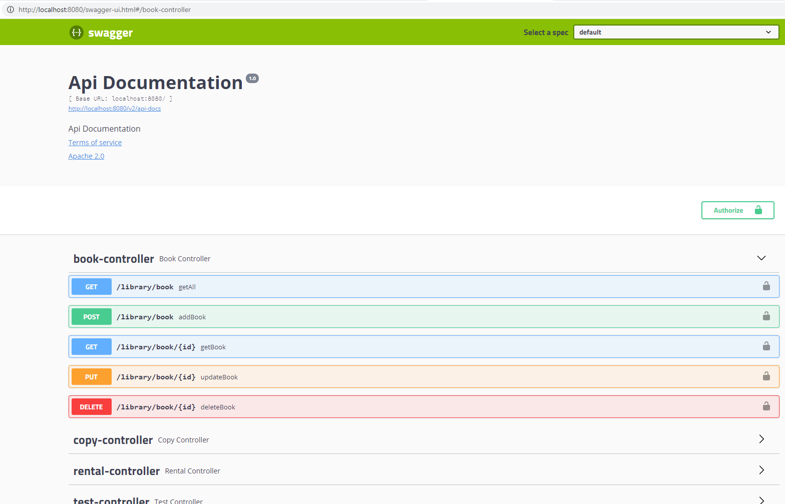

# kodilla-library
Kodilla Library Project

### 1. Project description 
The project consist of backend library service, based on REST architecture. 
### 2. Demo
Project is not uploaded to remote server yet. 

### 3. Requirements
Please make sure You have following software:
1) Java 8
2) Gradle 6.6.1
3) MySQL 8

### 4. Project 
In order to launch project You have to start LibraryApplication class.
You can check endpoints operation on [http://localhost:8080](http://localhost:8080) address.
### 5. Endpoint description
All information regarding endpoints are covered in Swagger documentation.
Please visit [http://localhost:8080/swagger-ui.html#/](http://localhost:8080/swagger-ui.html#/) after project is started and click on desired function.

### 6. Future plans
Plans to improve project with:
1) Spring authentication 
2) Transactional features
3) Automatic mailing features

### 7. Troubleshooting 
If You encounter any problems regarding operation, please let us know. 